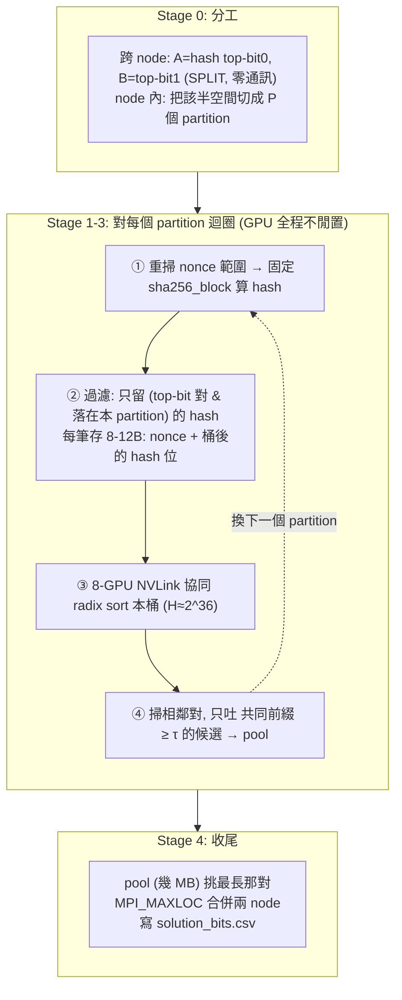

# 11 — 完整 Pipeline 設計：衝 80 bit

> 回應「以 16×H200 / 224 核 / 2 node / 2TB RAM(/node) 規劃 pipeline，目標 80 bit，做法是『前 64 bit 照搜、撞到的存起來、最後在 pool 裡看還有沒有更長的』，這樣有機會嗎？」
>
> **修訂版**：經查證後，通往 80 bit 的正確路徑**不是**把資料存進 NVMe，而是 **partition-by-regeneration（重算，不儲存）**。以下先給裁決，再證明，再給完整 pipeline。

---

## 0. 可行性裁決（先看這個）

| 佈局 | 分數【估計】 | 靠什麼 | 複雜度 | 建議 |
|---|---:|---|---|---|
| HBM-only 單趟 | ~73–74 | 填滿 HBM → sort 一次 | 低 | 當**安全地板** |
| NVMe out-of-core | ~76 | 寫 NVMe → external sort | 高 | ❌ **不值得**（I/O bound） |
| Regen，每 GPU 各自分桶 + SPLIT | ~77 | 重算，每桶塞單卡 HBM | 中 | 過渡版 |
| **Regen + 節點內 8-GPU 協同排序 + SPLIT** | **~79–81** | 重算 + NVLink 協同把每桶 H 拉大 | 中高 | ✅ **主線，正好衝 80** |
| Regen + 跨節點協同 | ~82 | 上面再跨 node 協同（吃 IB） | 高 | 追極限才用 |

**一句話**：**80 bit 有機會，而且比你想的更穩——但關鍵不是「存起來」，是「重算」。** 在本機上，重算一個 hash 比「寫出去再讀回來」的 NVMe I/O **快 ~20~30×**（[07](07-multinode-and-io.md) Part 4 已量化）。所以正解是：**把雜湊空間切成很多 partition，一個一個重算、只留落在該桶的、在記憶體內排序找最佳、換下一桶**——全程不落地、不跨節點傳資料。

> ⚠️ 你的三步驟「照搜→存起來→pool 再找」**邏輯對**，但「**存起來**」這一步要改成「**只把每桶的最佳候選留在記憶體（幾 KB 的 pool），大量 hash 用重算而非儲存**」。詳見 §2。

---

## 1. 為什麼是「重算」而不是「儲存」

各層頻寬地形（本題資料流的真正地貌）：

| 資源 | 單位頻寬 | 說明 |
|---|---:|---|
| 生成 SHA（固定 kernel） | ~4–12 GH/s/GPU⚠️ | H200 INT32 減半，估計，待實測 |
| HBM3e | 4.8 TB/s/GPU | HBM 內排序超快 |
| NVLink4 / NVSwitch（節點內） | **900 GB/s/GPU 雙向、non-blocking** [1] | 節點內 8-GPU 協同排序幾乎免費 |
| PCIe5（GPU↔host） | ~64 GB/s/GPU | |
| Host RAM (SPR 8ch DDR5) | ~600 GB/s/node | RAM staging 用 |
| InfiniBand（跨節點） | 400 GB/s/node | 跨節點瓶頸 |
| **NVMe RAID0** | **~30–50 GB/s/node** [2] | **最慢一層** |

**核心不等式**（同級單位，per node）：
```
單 node 重算率 ≈ 8×8 GH/s = 6.4×10^10 hash/s
單 node NVMe I/O ≈ 40 GB/s ÷ 16 B = 2.5×10^9 key/s
→ 重算比「寫+讀」快 ~25×
```
只要「重算一個 hash」比「把它存起來再讀回來」便宜，就**永遠選重算**。這把 NVMe 從主線踢掉（[07](07-multinode-and-io.md) 有完整推導：external sort 是 4× I/O、頂多到 ~2^38≈76 bit，而且 2^42 個 key = 70TB 根本塞不進 30TB）。

---

## 2. 修正你的兩階段想法

你的計畫：**① 前 64 bit 照搜 → ② 撞到的存起來 → ③ pool 裡再找更長的**。

| 你的說法 | 正確對應 | 修正 |
|---|---|---|
| 「前 64 bit 照搜」 | 對每個 partition：重算 + 在桶內排序找最近對 | ⚠️ 「照搜」= 必須把該桶的所有 hash 都比過；門檻 64 只是**吐出候選的條件**，不是搜尋條件 |
| 「撞到的**存起來**」 | 只把「共同前綴 ≥ τ」的候選對留在**記憶體 pool** | ❌ 不要存全部 hash 到 NVMe；大量 hash 用**重算**。pool 極小 |
| 「pool 裡再找更長的」 | 收尾在 pool 挑最長 → 寫 CSV | ✅ 幾乎不花時間 |

**pool 有多小？** N=2^41 時，前 64 bit 碰撞對數 ≈ `N²/2·2^-64 = 2^82/2^64/2 ≈ 2^17 ≈ 13 萬對` → 幾 MB。其中能延伸到 ≥80 bit 的期望 ≈ `13萬×2^-16 ≈ 2` → **約 2 對達 80**（N 抓到 2^41 就有安全邊際；2^40.5 只有 ~0.5 對，太邊緣）。

> **記憶體陷阱（最重要）**：天真做法要「同時握住所有 N 筆」才驗得出誰跟誰前 64 bit 相同 → 那是 35TB 工作集，塞不下。破解 = **prefix-partitioning**：全域最佳那對一定共享最高幾 bit → 必在同一桶 → **一次只處理一桶**（塞得進記憶體），就不漏。你的「pool」正是每桶排序後吐出的 ≥τ 候選。

---

## 3. 分數的決定公式：`N = √(生成預算 × H)`

partition-by-regeneration 的數學（[07](07-multinode-and-io.md) Part 3、[02](02-math-birthday-and-budget.md) §2.2）：

- 設每桶 resident 上限 = **H**（一次能同時排序多少 key）。
- 達到 N 個 distinct hash 需 `P = N/H` 個桶；每桶要重掃全範圍只留 1/P：
  ```
  總重算量 = P × N = N²/H   →   N = √(生成預算 × H)
  分數 ≈ 2·log₂(N)
  ```

**兩個槓桿**：生成預算（開 10 分鐘全力重算）、**H（每桶能排多大）**。因 `N ∝ √(預算×H)`：
- 生成率差 2× → 分數只差 ~1 bit（**極穩健**）。
- **H 才是能不能破 80 的關鍵**：H 每 ×4 → 分數 +1 bit。

**H 階梯（決定名次的地方）**：

| H 取法 | H（keys） | 需要什麼 | node 內分數* |
|---|---:|---|---:|
| 單卡 HBM | 2^33 | 無（各 GPU 獨立分桶） | ~77 |
| **8-GPU 協同排序（HBM 池化）** | **2^36** | **NVLink all-to-all（RMG 式多 GPU sort）** | **~80** |
| Node RAM staging | 2^37 | 留桶到 host RAM，再二次分桶進 HBM | ~81 |

\* 以生成 ~8 GH/s/GPU（node 預算 2^45）、含 SPLIT 的 2× 產生penalty 計算。細節見 §5。

→ **要衝 80，H 必須 ≈ 2^36：靠節點內 8-GPU 用 NVLink 協同排序把每桶做大**（NVLink 900GB/s non-blocking，這步幾乎免費 [1]）。單卡各自分桶只到 ~77。

---

## 4. 完整 Pipeline 架構（regeneration 版）



**逐階段**：
- **Stage 0 分工**：跨 node 用 **SPLIT**（node A 只做 hash 前 1 bit=0、node B=1，另一半當場丟棄）→ **零跨節點資料傳輸**。node 內把自己那半再切 P 個 partition（依 hash 接下來幾 bit）。
- **Stage 1 重算+過濾（融合成單一 kernel）**：★ 算完 hash **直接在 kernel 內判斷 top-bit 與 partition，只寫入符合的**——不要像範本先把所有 hash 寫回 HBM 再讀（省一整趟頻寬，這是範本最大的錯 [collision.cu:246](../mystery/q1_new_collision/collision.cu)）。每筆只存 **8~12 B**（8B nonce + 0~4B「桶之後的 hash 位」當排序鍵；桶前綴由所在桶隱含，不存）。
- **Stage 2 協同排序**：8 張 GPU 用 NVLink 協同把本桶（~2^36 key）排序（RMG 式：本地排序 + P2P all-to-all 交換，開銷 <8% [04](04-gpu-sort-and-partitioning.md)）。
- **Stage 3 掃描+吐候選**：掃相鄰對算共同前綴，**只把 ≥τ（56~64）的吐進記憶體 pool**。
- ★ **重疊**：GPU 排桶 *i* 時，背景重算桶 *i+1* 的 nonce。全程 GPU 不閒置。
- **Stage 4 收尾**：pool 挑最長 → `MPI_MAXLOC` 兩 node 合併（16B，可忽略）→ 寫 `solution_<bits>.csv`。

---

## 5. 雙節點 + 8 GPU 分工（含 SPLIT 的誠實代價）

### 5.1 跨節點：SPLIT（零通訊）——建議
- node A 只留 hash top-bit=0，node B 留 top-bit=1，各自獨立跑到收尾。
- 全域最佳那對**同 top-bit → 必在同一 node** → 兩 node 完全獨立，只在最後交換各自最佳一對。**完全不吃 InfiniBand 資料頻寬。**

### 5.2 SPLIT 到底有沒有少 bit？（誠實版）
- 有兩個小代價：(a) 每 node 要丟掉另一半 → **2× 生成penalty**（= √2 ≈ 0.5 bit）；(b) 最佳對只在單一 node 的 N_node 筆裡找，不是全叢集合池。
- 定量：SPLIT + 8-GPU 協同（H_node=2^36、node 預算 2^45）→ `N_node = √(2^45 × 2^36 / 2) = 2^40` → **分數 ≈ 80**。
- 對照「跨節點協同」（不丟棄、H 池化到 2^37、但排序要跨 IB）→ ~82。
- **結論**：SPLIT 比理論跨節點最佳約**少 ~1.5 bit**，但換來**零跨節點通訊 + 好除錯 + 無 straggler**。⚠️ [07](07-multinode-and-io.md) 說「SPLIT 完全不損分」是**略為樂觀**；誠實地說是「少約 1~1.5 bit，但仍穩過 80，且複雜度低很多」。**建議先用 SPLIT 拿 80，行有餘力再挑戰跨節點協同的 +1.5 bit。**

### 5.3 節點內 8 GPU：NVLink 協同（把 H 做大）
- 這是把分數從 ~77 拉到 ~80 的關鍵。8 GPU 用 NVLink（900GB/s non-blocking [1]）做多 GPU radix sort，每桶 H 從單卡 2^33 拉到 8 卡 2^36。
- 替代方案：桶先落 host RAM（2TB/node → 2^37 keys），再二次分桶進單卡 HBM 排序（H 有效 ~2^37，不需寫多 GPU sort 程式）。二選一看實作成本與實測。

### 5.4 CPU（224 核）
- 生成貢獻可忽略（<3%）。用途：協調 partition 佇列、維護 pool/running best、prefetch 排程、`MPI_MAXLOC` 收尾。用 OpenMP 一 thread 一 GPU（Makefile 已預開 `-fopenmp`）。

---

## 6. 參數建議

| 參數 | 建議 | 理由 |
|---|---|---|
| bytes/key | **8–12 B** | 每減半 +0.5 bit；桶前綴隱含不存 |
| 每桶 H | ~2^36（8-GPU 協同）或 ~2^37（RAM staging） | 決定能否破 80 |
| partition 數 P | `N/H` ≈ 16~32/node | 太多桶 → 重算次數多；太少 → 桶塞不下 |
| 候選門檻 τ | 56–64 | pool 保持 MB 級；τ < 目標即不漏 |
| 排序鍵寬 | 桶後取 64 bit | 少 radix pass |
| 跨 node | SPLIT（top-bit） | 零通訊 |
| node 內 | NVLink 協同排序 | 拉大 H |
| N 目標 | node 各 ~2^40（合計 ~2^41） | 對應分數 ~80 |
| 安全邊際 | 留 ~30 s 收尾 | 避免踩 10 分鐘線 |

---

## 7. 10 分鐘時間預算（主線：regen + 協同 + SPLIT，每 node N_node≈2^40）

| 步驟 | 估時 | 說明 |
|---|---:|---|
| 重算 + 過濾（P≈16 桶 × 每桶掃 2^41 nonce） | ~560 s | 主成本；59 GH/s/node，**生成-bound** |
| 8-GPU 協同排序（16 桶 × 2^36 key） | ~10 s | 與重算重疊，幾乎不佔額外時間 |
| 掃描 + pool | <5 s | pool 幾 MB |
| 收尾（MAXLOC + 寫 CSV） | ~20 s | 留邊際 |
| **合計** | **~590 s** | ✅ 落在 600s，但**很緊** → N 抓略低於 2^40 保險 |

→ **主線是「生成-bound」，GPU 全程滿載，沒有 I/O 等待。** 這正是重算法優於儲存法的地方：時間全花在有用的計算上。若 kernel 實測比 8 GH/s 慢，等比縮 N（`N∝√率`，慢 2× 只降 1 bit）。

對照 **HBM-only 單趟**（安全地板）：只花 ~10~30 秒填滿 HBM+sort → 分數 ~73~74，穩拿，剩下時間可 best-of-k。

---

## 8. 為什麼不用 NVMe / DP

- **NVMe**：external sort 4× I/O，頂多 ~2^38（76 bit），且 2^42 key=70TB>30TB 存不下；重算快 ~25×。NVMe 只拿來 checkpoint best-so-far（[07](07-multinode-and-io.md) Part 4）。
- **Distinguished Points**：攜帶 state=64-bit nonce → **上限 ~64 bit**，達不到 80（[01 §3.3](01-problem-analysis.md)）。

---

## 9. 決定 80 能否成的 microbenchmark（拿到機器先量）

| # | 量什麼 | 影響 | 工具 |
|---|---|---|---|
| 1 | **固定 kernel 實際 GH/s**（單卡+16卡） | 決定生成預算 → N（√關係，較穩） | 自寫計時 |
| 2 | **8-GPU NVLink 協同排序的 keys/s 與 all-to-all 開銷** | 決定 H 能否到 2^36 → **能否破 80** | nccl-tests, cub |
| 3 | RAM 實際容量（2TB/node?） | RAM staging 上限 → H | `free -g` |
| 4 | `cub::DeviceRadixSort` uint64 keys/s | sort 是否跟得上重算 | cub bench |
| 5 | NVLink 拓撲/頻寬 | 協同排序前提 | `nvidia-smi topo -m` |

⚠️ 不要啟動 `opensmd`（IB fabric 已配置）。詳見 [10](10-open-questions-and-benchmarks.md)。

---

## 10. 建議執行順序（務實路線）

1. **先做 HBM-only 單趟版（~73~74，安全地板）**：改掉範本三大錯（融合過濾、GPU 內排序不回 host qsort、多 GPU），SPLIT 分兩 node。10 分鐘內絕對跑完，先確保有分。
2. **量 §9 的 #1、#2**（kernel 速度、NVLink 協同排序）。
3. **升級成 partition-by-regeneration + 8-GPU 協同排序（主線，~80）**：這是衝 80 的版本。
4. **行有餘力**：跨節點協同 +1.5 bit（~82），或 best-of-k 靠 ±1.9 bit variance 多撈 2~3 bit。
5. 全程 SPLIT，穩定好除錯。

---

## 附：對照你的原始構想

| 你的說法 | 對應 | 裁決 |
|---|---|---|
| 「前 64 bit 照搜」 | 每桶重算 + 桶內排序 | ✅ 但要 partition，且門檻只影響吐出量 |
| 「撞到的**存起來**」 | 只留 ≥τ 候選在**記憶體 pool**；大量 hash **重算不儲存** | ⚠️ **關鍵修正**：別存 NVMe，用重算（快 ~25×） |
| 「pool 裡再找更長的」 | 收尾挑最長 | ✅ 幾乎免費 |
| 「80 bit 有機會嗎」 | §0 裁決 | ✅ **有，且穩**：regen + 8-GPU 協同 + SPLIT ≈ 80；別走 NVMe |

> 參考：[1] [NVLink4/NVSwitch 900GB/s non-blocking](https://developer.nvidia.com/blog/nvidia-nvlink-and-nvidia-nvswitch-supercharge-large-language-model-inference/)；[2] [8×Gen5 NVMe RAID0 實測](https://en.dapustor.com/news/41.html)。生成率修正自 [Hashcat RTX4090 gist](https://gist.github.com/Chick3nman/32e662a5bb63bc4f51b847bb422222fd)（SHA-256=22 GH/s，非 50.9=SHA-1）。演算法/排序/I/O 常數見 [04](04-gpu-sort-and-partitioning.md)/[07](07-multinode-and-io.md)。所有 GH/s、keys/s、分數為**估計，待本機實測**（誤差 2~3×，但因 N∝√預算，結論排序穩健）。
